

  

<h1 align="center">mmAutoMount</h1>

  Verbindet deine Netzwerklaufwerke automatisch, sobald du dich am Mac anmeldest – ohne Anmeldefenster des Finders. 
  <a href="../../releases/latest"><b>Download</b></a> · <a href="#english">English</a>

<picture>
  <source media="(prefers-color-scheme: dark)" srcset="images/de/hero-dark.png">
  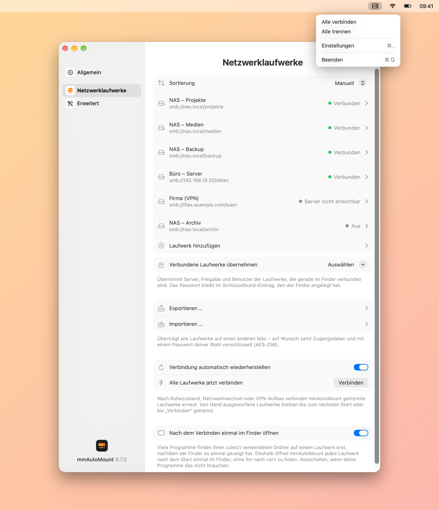
</picture>

## Funktionen

- **Automatisch verbinden:** nach der Anmeldung, nach dem Ruhezustand, bei Netzwerkwechsel und nach dem VPN-Aufbau. Von Hand ausgeworfene Laufwerke bleiben getrennt.
- **Wie im Finder:** Die Laufwerke erscheinen unter `/Volumes` – Aliase funktionieren ohne Login-Fenster. Damit Programme ihre zuletzt verwendeten Ordner finden, zeigt mmAutoMount jedes Laufwerk nach dem Start einmal im Finder (abschaltbar).
- **Zugangsdaten im Schlüsselbund:** eigenes Passwort, der Eintrag des Finders oder Gast. Nichts davon steht in den Einstellungen.
- **Beliebig viele Laufwerke** (SMB, AFP, NFS, WebDAV): verbundene Laufwerke mit einem Klick übernehmen, Einträge duplizieren, sortieren per Drag & Drop, nach Name oder Änderungsdatum.
- **Export und Import** für den Umzug auf einen anderen Mac – auf Wunsch samt Zugangsdaten und mit Passwort verschlüsselt (AES-256).
- **Nur in der Menüleiste:** ein Klick öffnet die Einstellungen, ein Rechtsklick verbindet oder trennt alle Laufwerke. Das Symbol ist wählbar und abschaltbar.
- **Erscheinungsbild** automatisch wie das System, hell oder dunkel.
- **Aufräumen:** entfernt die Schattendateien von macOS auf den Laufwerken – „._Name“, .DS_Store, „.Spotlight-V100“ und „.TemporaryItems“ – auf Knopfdruck oder täglich.
- **Automatische Updates** nach Bestätigung, **Deutsch, Englisch, Französisch, Italienisch und Spanisch**, Liquid Glass ab macOS 26.

<picture>
  <source media="(prefers-color-scheme: dark)" srcset="images/de/menubar-dark.png">
  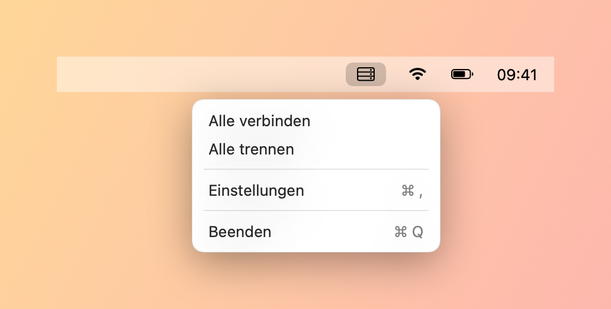
</picture>

## Einstellungen

  <picture>
    <source media="(prefers-color-scheme: dark)" srcset="images/de/settings-drives-dark.png">
    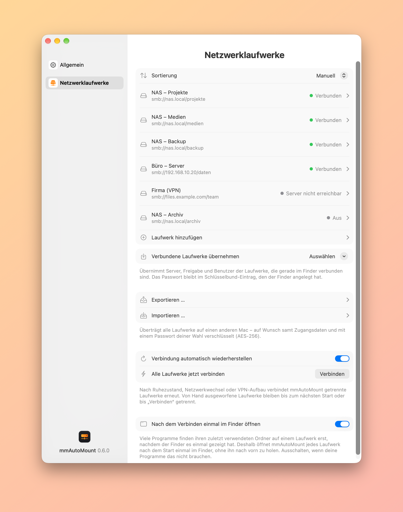
  </picture>
  <picture>
    <source media="(prefers-color-scheme: dark)" srcset="images/de/settings-general-dark.png">
    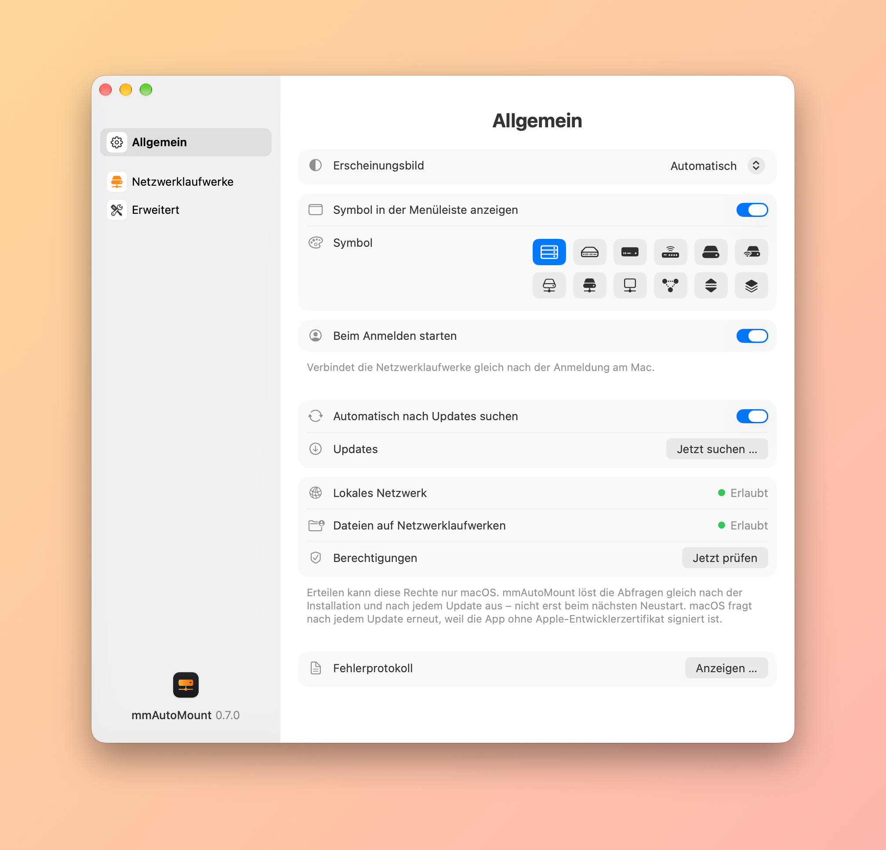
  </picture>

  <picture>
    <source media="(prefers-color-scheme: dark)" srcset="images/de/settings-advanced-dark.png">
    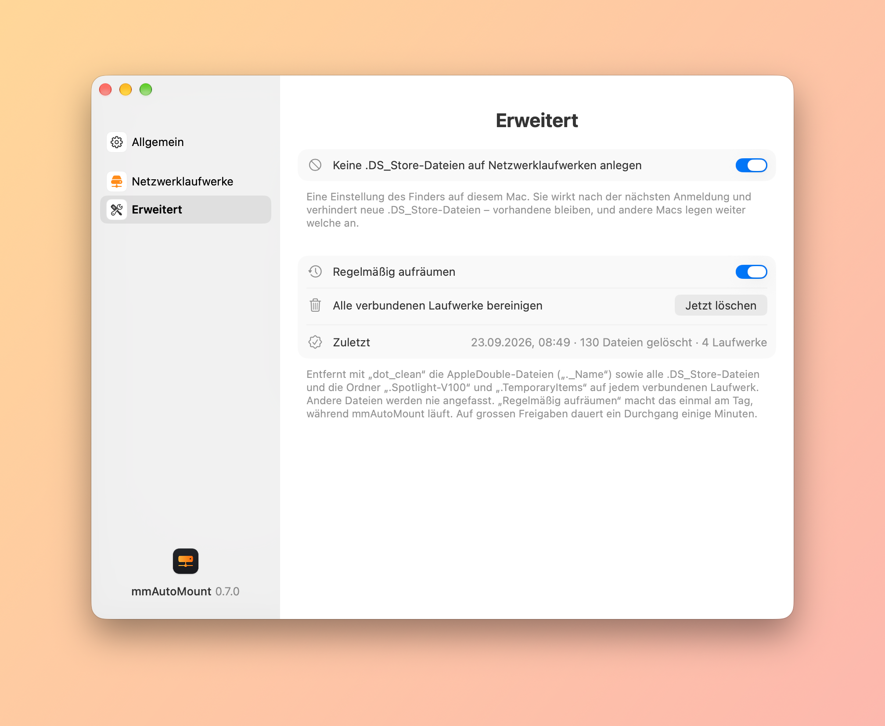
  </picture>

  <picture>
    <source media="(prefers-color-scheme: dark)" srcset="images/de/editor-dark.png">
    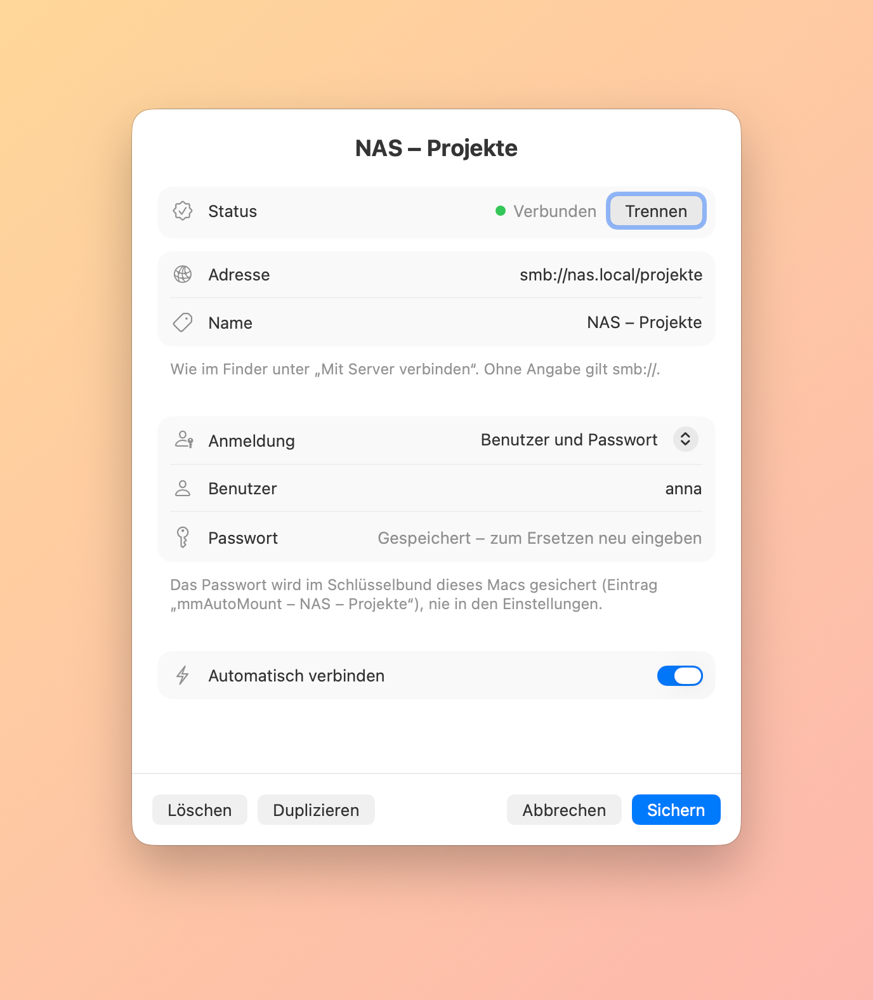
  </picture>
  <picture>
    <source media="(prefers-color-scheme: dark)" srcset="images/de/export-dark.png">
    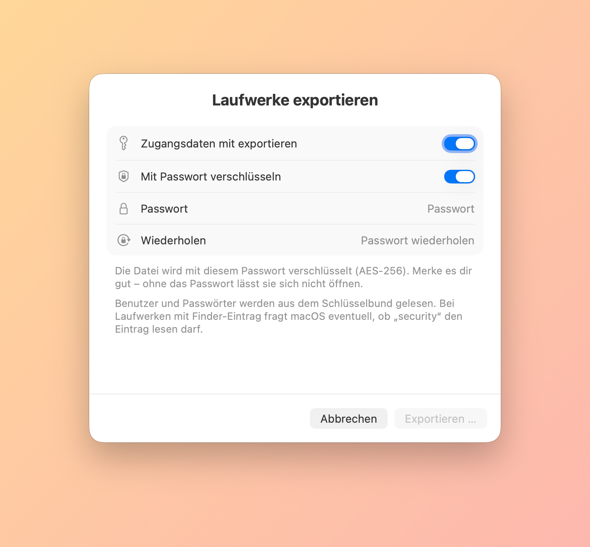
  </picture>
  <picture>
    <source media="(prefers-color-scheme: dark)" srcset="images/de/about-dark.png">
    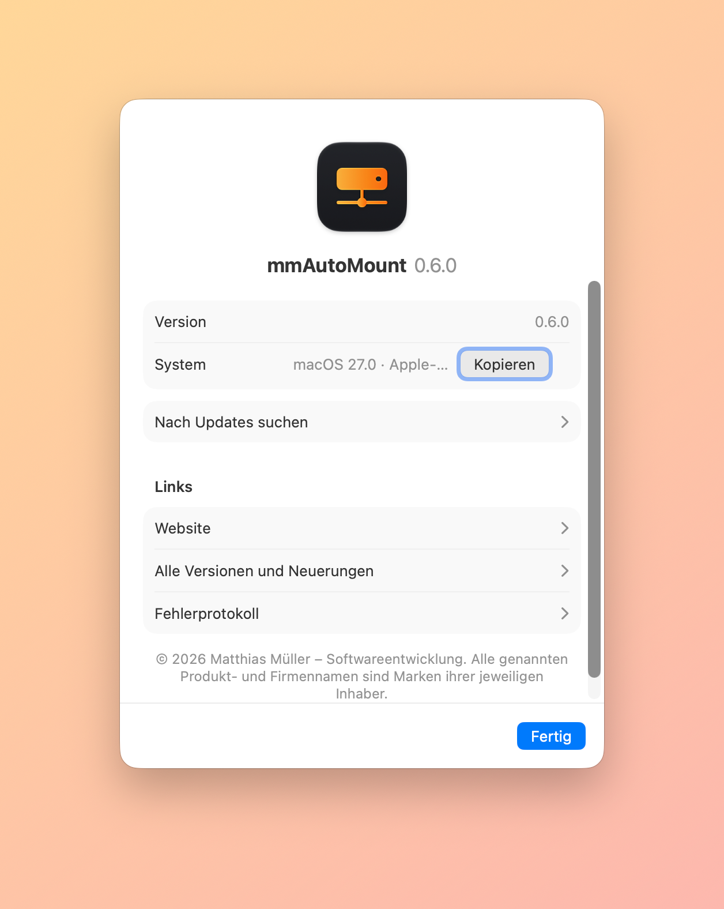
  </picture>

## Download und Installation

1. Unter [Releases](../../releases/latest) die Datei `mmAutoMount-<Version>.dmg` herunterladen.
2. DMG öffnen und mmAutoMount in den Ordner „Programme“ ziehen.
3. Beim ersten Start fragt macOS nach einer Freigabe: Systemeinstellungen › Datenschutz & Sicherheit › „Trotzdem öffnen“. Details stehen in der Anleitung in der DMG.
4. Unter „Netzwerklaufwerke“ die Laufwerke eintragen oder verbundene übernehmen, unter „Allgemein“ „Beim Anmelden starten“ einschalten.

Danach aktualisiert sich mmAutoMount selbst: Die App sucht täglich nach neuen Versionen und installiert sie nach Bestätigung (Einstellungen › Allgemein › „Jetzt suchen …“). macOS fragt nach jedem Update einmal nach dem Zugriff aufs lokale Netzwerk – mmAutoMount löst die Frage gleich nach dem Update aus.

## Voraussetzungen

- macOS 14 (Sonoma) oder neuer, Mac mit Apple-Chip oder Intel

---

## English

<picture>
  <source media="(prefers-color-scheme: dark)" srcset="images/en/hero-dark.png">
  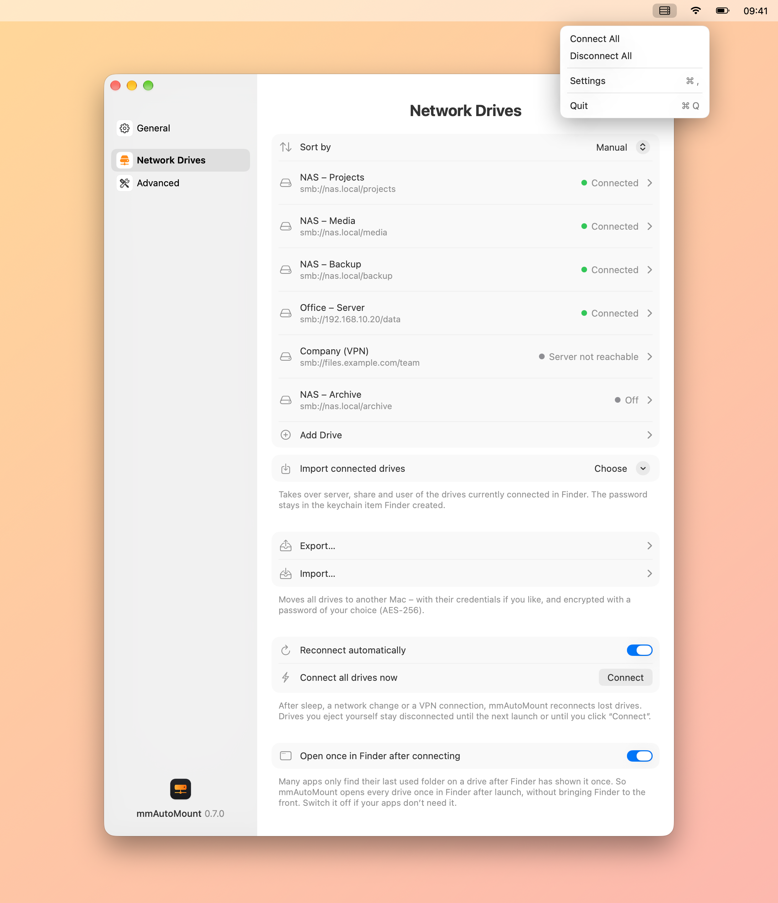
</picture>

mmAutoMount connects your network drives automatically as soon as you log in to your Mac – without Finder’s sign-in window.

- **Connects automatically:** after login, after sleep, on a network change and once your VPN is up. Drives you eject yourself stay disconnected.
- **Just like Finder:** drives appear under `/Volumes` – aliases work without a login window. So that apps find their recently used folders, mmAutoMount shows every drive once in Finder after launch (can be switched off).
- **Credentials in the keychain:** your own password, Finder’s keychain item, or guest. None of it is stored in the settings.
- **Any number of drives** (SMB, AFP, NFS, WebDAV): import connected drives with one click, duplicate entries, sort by drag and drop, by name or by modification date.
- **Export and import** for moving to another Mac – with credentials if you like, encrypted with a password (AES-256).
- **Menu bar only:** a click opens the settings, a right-click connects or disconnects all drives. The icon can be chosen or hidden.
- **Appearance** automatic like the system, light or dark.
- **Clean-up:** removes the shadow files macOS leaves on your drives – “._name”, .DS_Store, “.Spotlight-V100” and “.TemporaryItems” – on demand or daily.
- **Automatic updates** once you confirm, **English, German, French, Italian and Spanish**, Liquid Glass on macOS 26 and later.

  <picture>
    <source media="(prefers-color-scheme: dark)" srcset="images/en/settings-drives-dark.png">
    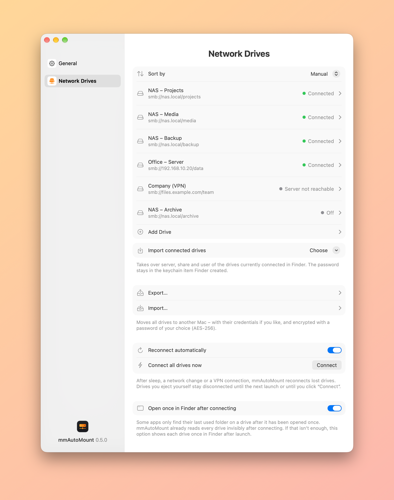
  </picture>
  <picture>
    <source media="(prefers-color-scheme: dark)" srcset="images/en/settings-general-dark.png">
    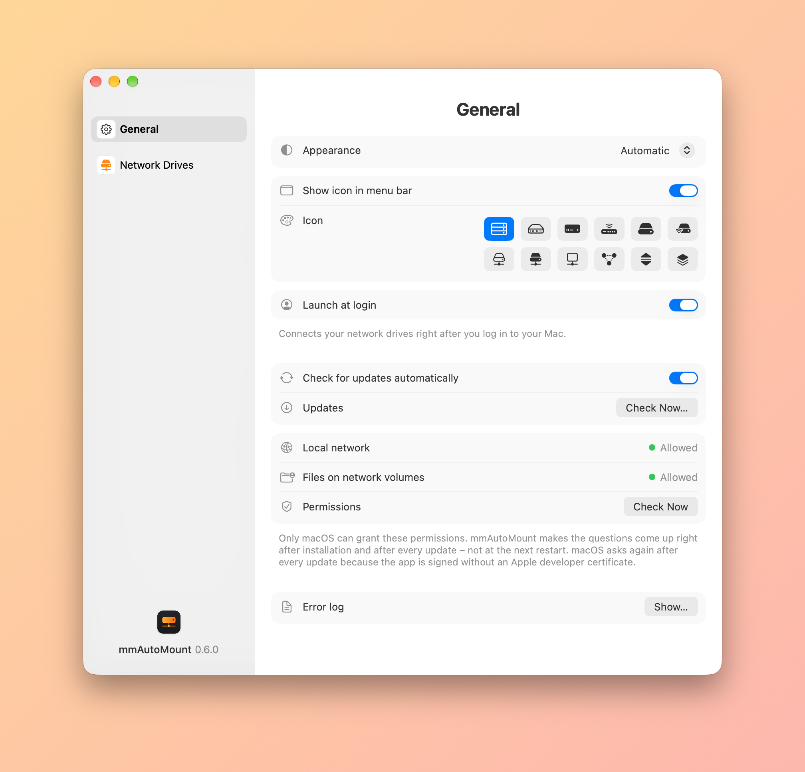
  </picture>
  <picture>
    <source media="(prefers-color-scheme: dark)" srcset="images/en/settings-advanced-dark.png">
    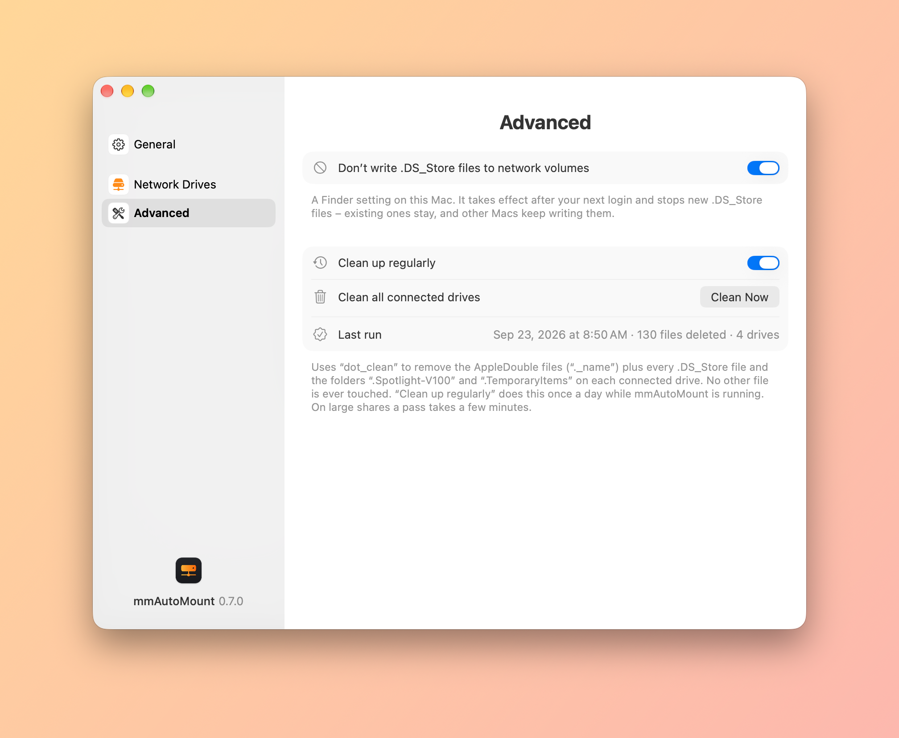
  </picture>

### Download and installation

1. Download `mmAutoMount-<version>.dmg` from [Releases](../../releases/latest).
2. Open the disk image and drag mmAutoMount to the Applications folder.
3. On first launch macOS asks for your approval: System Settings › Privacy & Security › “Open Anyway”. The guide inside the disk image (in German) has the details.
4. Add your drives under “Network Drives” or import the connected ones, and switch on “Launch at login” under “General”.

After that mmAutoMount updates itself: it checks for new versions daily and installs them once you confirm (Settings › General › “Check Now…”). macOS asks for local network access once after every update – mmAutoMount brings that question up right after the update.

### Requirements

- macOS 14 (Sonoma) or later, Mac with Apple silicon or Intel

---

© 2026 Matthias Müller – Softwareentwicklung · Alle Rechte vorbehalten / All rights reserved · [Lizenzbestimmungen / License terms](LICENSE.md) · [www.mm-softwareentwicklung.de](https://www.mm-softwareentwicklung.de)

Alle genannten Produkt- und Firmennamen sind Marken ihrer jeweiligen Inhaber. 
All product and company names mentioned are trademarks of their respective owners.
